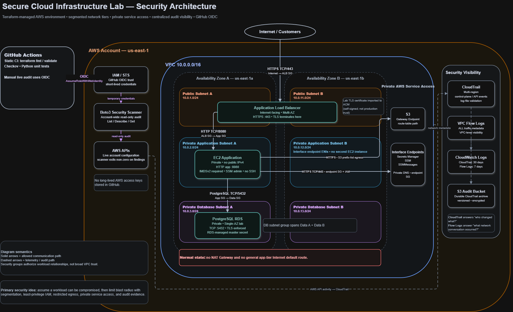

# Secure Cloud Infrastructure — Architecture

## Overview

The Secure Cloud Infrastructure Lab is a Terraform-managed AWS environment designed to demonstrate practical cloud security engineering principles.

The architecture uses:

* Network segmentation across public, application, and data tiers
* Private EC2 and RDS workloads
* Security-group-based workload relationships
* Restricted outbound connectivity
* VPC endpoints for private AWS service access
* Least-privilege IAM
* AWS Systems Manager instead of inbound SSH
* Centralized control-plane and network logging
* Terraform and Checkov for infrastructure validation
* A Python/Boto3 security scanner for live AWS account auditing
* GitHub Actions with AWS OIDC authentication

The primary application path is:

```text
Internet → HTTPS ALB → Private EC2 → Private PostgreSQL RDS
```

The architecture is intended as a security-focused lab rather than a production-ready highly available application platform.

---

## Architecture Diagram



The diagram separates application traffic, AWS service access, CI/CD authentication, and security telemetry so that trust boundaries and authorized communication paths are visible.

---

## Network Architecture

The environment uses a custom VPC:

```text
10.0.0.0/16
```

The VPC spans two Availability Zones and contains six subnets.

| Tier        | Availability Zone A | Availability Zone B |
| ----------- | ------------------- | ------------------- |
| Public      | `10.0.1.0/24`       | `10.0.11.0/24`      |
| Application | `10.0.2.0/24`       | `10.0.12.0/24`      |
| Data        | `10.0.3.0/24`       | `10.0.13.0/24`      |

The subnet design separates resources by trust level and function rather than placing all workloads in a single flat network.

### Public Tier

The public subnets host the Internet-facing Application Load Balancer.

A public route table provides:

```text
0.0.0.0/0 → Internet Gateway
```

The ALB spans both public subnets so the public entry point is available across two Availability Zones.

The public tier does not contain the EC2 application workload or the database.

### Application Tier

The EC2 application instance resides in a private application subnet.

The instance:

* Has no public IPv4 address
* Does not accept inbound SSH
* Receives application traffic only from the ALB
* Uses Systems Manager for administration
* Normally has no general-purpose Internet route

A second application subnet exists in the second Availability Zone to support VPC interface endpoints and demonstrate a network design capable of future multi-AZ expansion.

The lab intentionally deploys only one EC2 application instance, so the application tier itself is not highly available.

### Data Tier

PostgreSQL RDS resides in the private data tier.

The RDS subnet group includes data subnets from both Availability Zones, but the current database deployment is Single-AZ for lab cost and scope reasons.

The database is configured as:

```text
publicly_accessible = false
```

There is no intended Internet path directly to RDS.

---

## Security Group Design

The architecture uses security group references to authorize communication between workloads.

This is preferred over broadly allowing entire subnet or VPC CIDR ranges because the rule expresses which workload is trusted rather than merely which IP range it occupies.

The primary relationships are:

```text
Internet
   |
   | HTTPS TCP/443
   v
ALB Security Group
   |
   | HTTP TCP/8080
   v
Application Security Group
   |
   | PostgreSQL TCP/5432
   v
Database Security Group
```

### Internet → ALB

The ALB security group permits inbound HTTPS on TCP/443 from the Internet.

The ALB is the intended public entry point.

### ALB → EC2

The application security group permits inbound TCP/8080 only from the ALB security group.

This means an arbitrary host inside the VPC is not automatically trusted to access the application merely because it has a private IP address.

### EC2 → RDS

The database security group permits PostgreSQL TCP/5432 only from the application security group.

The database therefore accepts network connections from the application workload relationship rather than from broad network ranges.

### Default Security Group

The VPC default security group is explicitly restricted and contains no general ingress or egress rules.

This reduces the risk of accidentally deploying a resource with permissive default connectivity.

---

## Application Load Balancer and TLS

The Application Load Balancer is the only intentionally Internet-facing application component.

Clients connect using:

```text
HTTPS TCP/443
```

TLS terminates at the ALB.

The HTTPS listener uses a modern AWS TLS security policy.

For the lab, the certificate imported into AWS Certificate Manager is self-signed. This demonstrates TLS configuration and certificate handling but does not provide the public trust model expected in a production Internet application.

The ALB forwards requests to EC2 over:

```text
HTTP TCP/8080
```

Because backend traffic is not encrypted after TLS termination, encryption between the ALB and EC2 remains a documented lab limitation.

---

## EC2 Security

The application workload runs on a private EC2 instance.

Several controls reduce its attack surface.

### No Public IPv4 Address

The instance cannot be contacted directly from the Internet.

Internet traffic must first pass through the ALB.

### No Inbound SSH

Administrative access uses AWS Systems Manager Session Manager.

This avoids exposing TCP/22 and eliminates the need to manage inbound SSH access from administrator IP addresses.

### IMDSv2

The instance requires Instance Metadata Service Version 2.

IMDSv2 reduces the effectiveness of several metadata-service attack techniques by requiring a session-oriented token before instance metadata can be accessed.

It does not make instance-role credentials safe after complete host compromise, so IAM least privilege remains necessary.

### Encrypted Root Volume

The EC2 root EBS volume is encrypted.

---

## Restricted Outbound Connectivity

The application subnet normally has no default Internet route and does not require a NAT Gateway during standard operation.

This is an intentional security decision.

Rather than allowing:

```text
EC2 → arbitrary Internet destinations
```

the architecture allows only specific required communication paths.

Examples include:

```text
EC2 → RDS
EC2 → S3
EC2 → Secrets Manager
EC2 → Systems Manager
```

Restricting outbound connectivity reduces straightforward command-and-control, malware download, and data-exfiltration paths after application compromise.

It does not guarantee that exfiltration is impossible because an attacker may attempt to abuse an authorized service or application path.

---

## VPC Endpoints

AWS services required by EC2 are reached through private VPC connectivity.

The architecture uses both gateway and interface endpoints.

### S3 Gateway Endpoint

S3 uses a gateway VPC endpoint.

The application route table contains the required S3 prefix-list route.

The EC2 application security group restricts S3 egress to the AWS-managed S3 prefix list rather than allowing arbitrary Internet HTTPS traffic.

### Interface Endpoints

Interface endpoints are deployed for:

* AWS Systems Manager
* Systems Manager Messages
* Secrets Manager

Interface endpoints create private network interfaces inside the VPC.

Private DNS allows normal AWS service hostnames to resolve to those private endpoint addresses from the VPC.

The endpoint security group permits HTTPS traffic from the application security group.

### Network Access vs. Authorization

A VPC endpoint only provides a network path.

It does not grant AWS API permissions.

For example:

```text
EC2 → Secrets Manager endpoint
```

provides connectivity, while:

```text
EC2 IAM role → secretsmanager:GetSecretValue
```

determines whether the API request is authorized.

Both controls are required.

---

## IAM Architecture

IAM follows a least-privilege model.

The EC2 instance receives temporary role credentials through an instance profile rather than storing long-lived AWS access keys.

The application role is permitted only the AWS actions needed by the workload.

This limits the blast radius if the EC2 instance is compromised.

A compromised workload may still exercise permissions that the role legitimately possesses, which is why the IAM policy must remain narrowly scoped.

---

## Secrets Management

Database credentials are handled through AWS Secrets Manager.

RDS manages the database master secret rather than embedding the password directly in Terraform source code or Git.

The EC2 role receives permission to retrieve the required RDS secret.

This protects the credential from source-code exposure and simplifies secret distribution.

However, Secrets Manager does not protect a credential from an application host that is both compromised and legitimately authorized to retrieve that credential.

This remains one of the highest-impact residual risks identified in the threat model.

---

## RDS Security

The PostgreSQL database uses several defense-in-depth controls:

* Private network placement
* `publicly_accessible = false`
* Database SG access only from the application SG
* Encrypted storage
* Secrets Manager-managed credentials
* PostgreSQL TLS enforcement
* Connection and disconnection logging
* Slow-query logging
* Automated backups

The database currently uses a Single-AZ deployment.

This is an intentional lab tradeoff rather than a production high-availability design.

---

## CloudTrail

AWS CloudTrail provides control-plane visibility.

CloudTrail answers questions such as:

```text
Who changed this security group?
Which identity made the request?
When was the API call made?
Which AWS API was used?
```

The trail is configured as multi-region and includes global service events.

CloudTrail log-file validation is enabled.

Events are delivered to:

* CloudWatch Logs for searchable operational visibility
* An S3 audit bucket for durable storage

The S3 audit bucket uses public-access blocking, encryption, and versioning.

---

## VPC Flow Logs

VPC Flow Logs provide network-traffic metadata.

They help answer questions such as:

```text
Which source communicated with which destination?
Which port was used?
Was the traffic accepted or rejected?
```

Flow Logs operate at the network-visibility layer and complement CloudTrail rather than replacing it.

For example:

```text
CloudTrail:
An administrator authorized TCP/22 in a security group.

Flow Logs:
A host attempted a TCP/22 connection and the traffic was accepted.
```

Together, these provide control-plane and network evidence during security investigations.

---

## Terraform

Terraform defines the intended AWS infrastructure state.

Infrastructure is separated into logical configuration files such as:

```text
networking.tf
security_groups.tf
iam.tf
compute.tf
storage.tf
secrets.tf
endpoints.tf
logging.tf
load_balancer.tf
database.tf
```

Terraform provides repeatability, reviewable infrastructure changes, and drift detection.

Resources are normally changed through Terraform rather than manually through the AWS Console.

The AWS Console remains useful for inspection, visualization, and troubleshooting.

---

## Checkov

Checkov performs static security analysis against the Terraform configuration.

It serves as a preventive control by detecting insecure infrastructure definitions before they are deployed.

Examples include checks for:

* Insecure TLS policies
* Public resource exposure
* Missing database encryption controls
* Logging weaknesses
* Overly broad IAM configuration

Some production-oriented checks are deliberately suppressed when the associated control is outside the scope or cost target of the lab.

Each suppression is documented with its security rationale rather than ignored silently.

---

## Python Security Scanner

The project includes a Python/Boto3 security scanner that evaluates the deployed AWS account.

Unlike Checkov, which evaluates intended Terraform configuration, the scanner evaluates live AWS state.

The scanner checks areas including:

* S3 security controls
* EC2 public exposure
* IMDSv2
* EBS encryption
* Security-group exposure
* Route tables
* CloudTrail configuration
* VPC Flow Logs
* Required VPC endpoints
* Secrets Manager
* Subnet public-IP behavior

Findings are assigned severity weights and summarized in a security score.

The scanner intentionally operates account-wide.

As a result, resources outside the Terraform project—such as an insecure default VPC—may produce legitimate findings.

This demonstrates an important distinction:

```text
Terraform / Checkov
        ↓
What should exist?

Boto3 live scanner
        ↓
What actually exists?
```

---

## GitHub Actions and AWS OIDC

GitHub Actions performs automated project validation.

Normal push and pull-request workflows run:

* Terraform formatting validation
* Terraform initialization without a backend
* Terraform validation
* Checkov
* Python compilation
* Unit tests for the security scanner

The live AWS security scanner is executed manually through a separate workflow.

GitHub authenticates to AWS using OpenID Connect.

The authentication flow is:

```text
GitHub Actions
      |
      | OIDC identity token
      v
AWS IAM / STS
      |
      | short-lived role credentials
      v
Read-only AWS security scanner
```

This avoids storing long-lived AWS access keys in GitHub.

The AWS role used by the scanner has account-wide read permissions required by list, describe, and get operations but does not receive create, modify, or delete permissions.

---

## Preventive and Detective Controls

The project intentionally combines multiple security layers.

### Preventive

Controls intended to block or reduce insecure behavior include:

* Private EC2 and RDS placement
* Security-group segmentation
* Restricted egress
* Least-privilege IAM
* IMDSv2
* TLS
* Terraform validation
* Checkov
* GitHub CI

### Detective

Controls intended to identify or investigate security problems include:

* CloudTrail
* VPC Flow Logs
* Terraform drift detection
* Boto3 live security scanner
* PostgreSQL logging

Neither category is sufficient by itself.

Preventive controls reduce successful attacks while detective controls help identify failures, unauthorized changes, and suspicious activity.

---

## Availability and Scope Tradeoffs

The architecture deliberately does not implement every production control.

Examples include:

* Single EC2 application instance
* Single-AZ RDS
* No Auto Scaling Group
* No AWS WAF
* Self-signed certificate
* HTTP from ALB to EC2
* No cross-account immutable log archive
* No customer-managed KMS keys for every resource
* Limited CloudWatch log-retention periods

These are documented risk and cost decisions rather than assumptions that the controls are unnecessary.

A production system would reevaluate each decision based on business impact, compliance requirements, workload sensitivity, expected traffic, and availability objectives.

---

## Security Design Philosophy

The central design principle of the project is:

> Do not assume that being inside a private VPC makes a workload trusted.

The architecture assumes that individual components may eventually be compromised.

Security therefore focuses on limiting what a compromised component can reach and what permissions it can exercise.

The resulting model combines:

```text
Segmentation
      +
Least-privilege IAM
      +
Restricted egress
      +
Private AWS connectivity
      +
Centralized logging
      +
Automated security validation
      =
Reduced attack surface and blast radius
```

The system is not designed around the claim that compromise is impossible.

It is designed so that compromise becomes harder, attacker movement becomes more constrained, important assets remain separated, and useful evidence exists for investigation.
